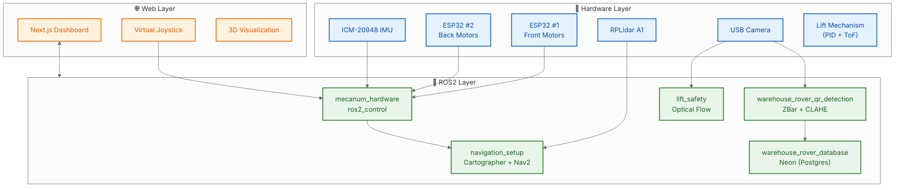
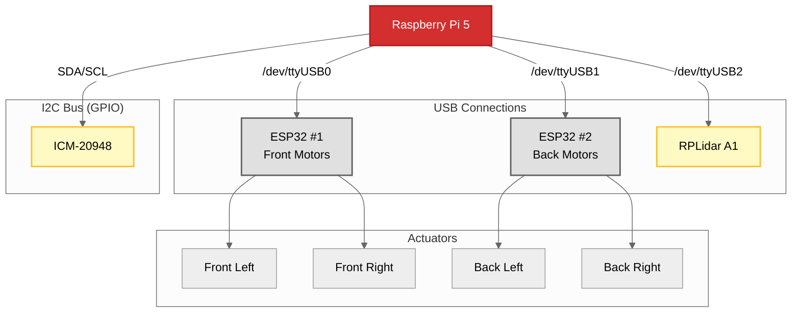
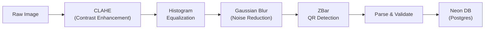

# 🏭 Warehouse Inventory Management Robot

<div align="center">

[](https://docs.ros.org/en/humble/)
[](https://python.org)
[](https://isocpp.org/)
[](https://nextjs.org/)
[](https://neon.tech/)
[](LICENSE)

### 🥉 **Bronze Medal Winner** | Inter IIT Tech Meet 14.0

**Problem Statement by Eternal: Autonomous Inventory Management**

*A 4WD Mecanum Robot for Autonomous Navigation, QR Scanning, and Real-Time Inventory Logging*

</div>

---

## 📹 Demo Videos

<!-- 
INSTRUCTIONS: Replace the placeholder paths below with your actual video files or YouTube links.
For local files: Place videos in a 'media/' folder and use relative paths.
For YouTube: Use the embed format shown in the comments.
-->

<div align="center">

| 🎬 Hardware Navigation | 🤖 MPPI Controller |
|:---:|:---:|
| [](https://drive.google.com/file/d/1SxE7VbpoMyJDe-7mRSphyiXIrN796s2v/view?usp=sharing) | [](https://drive.google.com/file/d/1yMgr9xhQmlWIOJ6BMVuErapGLEkPWAD1/view?usp=sharing) |
| [Watch Video](https://drive.google.com/file/d/1SxE7VbpoMyJDe-7mRSphyiXIrN796s2v/view?usp=sharing) | [Watch Video](https://drive.google.com/file/d/1yMgr9xhQmlWIOJ6BMVuErapGLEkPWAD1/view?usp=sharing) |

| 📱 QR Code Scanning | 🛡️ Optical Flow Safety |
|:---:|:---:|
| [](https://drive.google.com/file/d/1jlzJpVaomlOkv6ThRwU9cso8ifu2L015/view?usp=sharing) | [](https://drive.google.com/file/d/19zjg4Hd4r4iTfHF7JOrHWgnWNKGa0Jsm/view?usp=sharing) |
| [Watch Video](https://drive.google.com/file/d/1jlzJpVaomlOkv6ThRwU9cso8ifu2L015/view?usp=sharing) | [Watch Video](https://drive.google.com/file/d/19zjg4Hd4r4iTfHF7JOrHWgnWNKGa0Jsm/view?usp=sharing) |

</div>

---

## 📸 Project Gallery

<div align="center">

### 🤖 Robot Overview
<a href="https://drive.google.com/file/d/12Bs6bJ0aVyArBRewj-XbltesIlnt_Ru9/view?usp=sharing">
  
</a>

<br/><br/>

### 🏗️ Scissor Lift Mechanism
<a href="https://drive.google.com/file/d/1eT09PdCcN59-oF_Ee70JCgp37965IalH/view?usp=sharing">
  
</a>

</div>

---

## 📊 Presentation & Architecture

<div align="center">

📑 **[View Our Presentation](https://docs.google.com/presentation/d/1cAEmNjcDwh8xOOG8gRH6w87--OZm0wdz/edit?slide=id.p1#slide=id.p1)**

*Complete system architecture, design decisions, and implementation details*

</div>

---

## ✨ Highlights

| Feature | Description |
|---------|-------------|
| 🚗 **4WD Mecanum Drive** | Omnidirectional movement with custom SolidWorks URDF |
| 🗺️ **Google Cartographer SLAM** | Dual-config strategy for mapping & navigation |
| 📍 **Nav2 + MPPI Controller** | Optimized for mecanum kinematics |
| 📷 **QR Detection** | CLAHE + Histogram Equalization + ZBar |
| 🛡️ **Optical Flow Safety** | Real-time intrusion detection for lift mechanism |
| 🌐 **Web GUI** | Next.js dashboard with virtual joystick |
| ☁️ **Cloud Database** | Neon (PostgreSQL) for inventory storage |
| 🔧 **ESP32 Control** | Custom firmware for NEMA23 steppers |

---

## 🏗️ System Architecture



### TF Tree

```
map
 └── odom (AMCL in navigation / Cartographer in mapping)
      └── base_link (Cartographer sensor fusion)
           ├── imu_link
           ├── lidar_link
           ├── camera_link
           └── [wheel_frames × 4]
```

---

## 🛠️ Hardware Specifications

### Robot Platform

| Component | Specification |
|-----------|--------------|
| **Drive System** | 4WD Mecanum Wheels (100mm) |
| **Motors** | 4× NEMA23 Stepper Motors |
| **Motor Drivers** | TB6600 / DM556 |
| **Controllers** | 2× ESP32 (Serial @ 115200 baud) |
| **Main Computer** | Raspberry Pi 5 (4GB) → *Pi 4 (2GB) during demo* |
| **LiDAR** | RPLidar A1 (360° @ 5.5 Hz) |
| **Camera** | USB Camera (640×480) |
| **IMU** | ICM-20948 (9-axis) |
| **Lift Sensor** | VL53L0X ToF Laser |

### Wiring Diagram



---

## 📦 ROS2 Packages

### Package Overview

| Package | Language | Purpose |
|---------|----------|---------|
| `mecanum_hardware` | C++ | ros2_control hardware interface for ESP32 + IMU |
| `mecanum_in_gazebo` | XML/Python | Gazebo simulation with full URDF |
| `navigation_setup` | Lua/Python | Cartographer SLAM + Nav2 configuration |
| `warehouse_rover_qr_detection` | C++ | ZBar-based QR code detection |
| `warehouse_rover_image_processing` | C++ | CLAHE + CUDA/CPU image preprocessing |
| `warehouse_rover_database` | Python | Neon (Postgres) cloud storage integration |
| `warehouse_rover_rack_detection` | C++ | Warehouse rack detection |
| `lift_safety` | Python | Optical flow intrusion detection |
| `warehouse_rover_msgs` | ROS2 IDL | Custom message definitions |

---

## 🗺️ Navigation Stack

### The Journey: From EKF Pain to Cartographer Success

We initially used **SLAM Toolbox + EKF** but faced severe challenges:

- ❌ Odometry drift
- ❌ Distorted maps  
- ❌ Unstable localization
- ❌ Poor fusion with only IMU + wheel odometry

**Solution: Google Cartographer**

Cartographer directly consumes `/imu`, `/scan`, and `/odom` and handles fusion internally. No EKF configuration pain!

### Dual Cartographer Configuration Strategy

We use **two separate Lua configurations** to avoid TF conflicts:

| Mode | Config File | TF Published | Use Case |
|------|-------------|--------------|----------|
| **Mapping** | `cartographer_mapping.lua` | `map → odom → base_link` | Building new maps |
| **Navigation** | `cartographer_odom.lua` | `odom → base_link` only | Autonomous driving |

**Why?** In navigation mode, both AMCL and Cartographer would try to publish `map → odom`. Our solution: Cartographer handles sensor fusion only, AMCL handles localization.

### MPPI Controller for Mecanum

DWB (Dynamic Window Based) controller didn't work well for mecanum. Switching to **MPPI (Model Predictive Path Integral)** finally gave us smooth omnidirectional navigation.

### Automatic Waypoint Generation

We used **OpenCV** to auto-generate waypoints from the occupancy grid map:

```python
# Simplified approach
contours = cv2.findContours(map_image, ...)
waypoints = extract_rack_positions(contours)
```

---

## 📷 Image Processing Pipeline

Our QR detection pipeline uses multiple enhancement techniques for robust detection under varying lighting:



### CLAHE (Contrast Limited Adaptive Histogram Equalization)

```cpp
cv::Ptr<cv::CLAHE> clahe = cv::createCLAHE(2.0, cv::Size(8, 8));
clahe->apply(gray_image, enhanced);
```


## 🛡️ Lift Safety System

The lifting mechanism includes an **optical flow-based safety system** to detect intrusions:

### How It Works

1. **Capture** continuous frames from camera
2. **Calculate** dense optical flow (Farneback algorithm)
3. **Detect** motion that isn't vertical (lift movement)
4. **Stop** immediately if foreign object detected

```python
# Dense Optical Flow Detection
flow = cv2.calcOpticalFlowFarneback(prev_frame, next_frame, ...)
mag, ang = cv2.cartToPolar(flow[..., 0], flow[..., 1])

# Ignore vertical motion (lift going up/down)
ignore_up = (ang > 65) & (ang < 115)
ignore_down = (ang > 245) & (ang < 295)

# Any other motion = intrusion!
alarm_mask = motion_mask & (~ignore_up) & (~ignore_down)
```

**Safety Feature:** If you put your hand (or any object) in the lift path, it **stops immediately**.

---

## 🌐 Web-Based GUI

Built with **Next.js 14** for modern, responsive control from any device on the same WiFi network.

### Features

| Component | Description |
|-----------|-------------|
| `WarehouseRoverDashboard` | Main dashboard with telemetry |
| `SimpleLaunchControl` | One-click ROS2 launch management |
| `virtual-joystick` | Touch-based robot control |
| `three-d-rover` | 3D WebGL robot visualization |
| `telemetry-chart` | Real-time sensor graphs |
| `mission-launch-sequence` | Animated mission startup |

### Starting the Web GUI

```bash
cd my-app/my-app
npm install
npm run dev
# Open http://localhost:3000
```

---

## ☁️ Database Integration

### Neon (PostgreSQL) Cloud Storage

We replaced local storage with **Neon (Serverless PostgreSQL)** for robust, scalable inventory management:

```
┌─────────────────────────────────────────────────────────┐
│                    Neon (PostgreSQL)                    │
│  ┌──────────────────┐      ┌──────────────────────┐   │
│  │    missions      │      │     detections        │   │
│  │  - id (UUID)     │      │  - id (UUID)          │   │
│  │  - start_time    │      │  - mission_id (FK)    │   │
│  │  - end_time      │      │  - rack_id            │   │
│  │  - status        │      │  - item_code          │   │
│  │  - total_items   │      │  - confidence         │   │
│  └──────────────────┘      │  - timestamp          │   │
│                            └──────────────────────┘   │
└─────────────────────────────────────────────────────────┘
```

### Detection Data Schema

```sql
CREATE TABLE detections (
    id UUID PRIMARY KEY DEFAULT gen_random_uuid(),
    mission_id UUID REFERENCES missions(id),
    rack_id VARCHAR(50),
    shelf_id VARCHAR(50),
    item_code VARCHAR(100),
    confidence FLOAT,
    timestamp TIMESTAMPTZ DEFAULT NOW()
);
```

### Why Neon?

- **Serverless**: Scales to zero when robot is idle
- **Branching**: Easy to split database for dev/test/prod environments
- **Performance**: High-speed queries for real-time inventory dashboards

---

## 🔧 ESP32 Firmware

### Communication Protocol

**Command Format (ROS2 → ESP32):**
```
V,<steps_per_sec_motor1>,<steps_per_sec_motor2>\n
```

**Example:**
```
V,400,-300\n  # Motor 1: 400 steps/s forward, Motor 2: 300 steps/s backward
```

**ESP32 Assignment:**

| ESP32 | Motors | Serial Port |
|-------|--------|-------------|
| ESP32 #1 | Front Left + Front Right | `/dev/ttyUSB0` |
| ESP32 #2 | Back Left + Back Right | `/dev/ttyUSB1` |

### Features

- ✅ Acceleration limiting (2000 steps/s²)
- ✅ Watchdog timer (500ms timeout)
- ✅ Emergency stop support
- ✅ Status reporting

---

## 🚀 Quick Start

### Prerequisites

```bash
# ROS2 Humble
sudo apt install ros-humble-desktop

# Dependencies
sudo apt install ros-humble-cartographer-ros ros-humble-nav2-bringup \
    ros-humble-ros2-control ros-humble-ros2-controllers \
    libzbar-dev python3-pymongo
```

### Clone & Build

```bash
git clone https://github.com/anishk85/WareHouse-Inventory-Management-.git
cd WareHouse-Inventory-Management-/src
colcon build
source install/setup.bash
```

### Launch Simulation

```bash
# Terminal 1: Gazebo
ros2 launch mecanum_in_gazebo gazebo.launch.py

# Terminal 2: Navigation
ros2 launch navigation_setup cartographer_mapping.launch.py use_sim:=true

# Terminal 3: Teleop
ros2 run mecanum_in_gazebo mecanum_teleop_key.py
```

### Launch Hardware (Raspberry Pi)

```bash
# Mapping mode
ros2 launch mecanum_hardware hardware_mapping.launch.py

# Navigation mode (with saved map)
ros2 launch mecanum_hardware hardware_navigation.launch.py \
    map:=/path/to/saved_map.yaml
```

---

## 🌿 Branches

| Branch | Purpose |
|--------|---------|
| `main` | Primary development branch |
| `hardware-2` | Hardware-specific optimizations for Raspberry Pi deployment |

---

## 📖 The Journey

<details>
<summary><b>Click to expand our 1.5-month journey</b></summary>

### The Challenge

- ⏰ **1.5 months** of development
- 📚 End-semester exams running parallel
- 😴 Sleeping at 2 AM, waking up at 4 AM
- 💪 Sleepless nights of debugging

### URDF Struggles

Mecanum wheels were the real challenge. Force-based control was common, but defining a **correct URDF for mecanum wheels** was the hard part. We:

1. Studied existing URDFs
2. Understood roller and wheel frames
3. Redefined everything in **SolidWorks**
4. Finally got a clean URDF pipeline

### Simulator Wars

We initially blamed the simulator. Gazebo physics felt unreliable, so we moved to **MuJoCo**, but the issues stayed. The problem wasn't the simulator—it was our odometry fusion.

### The EKF Nightmare

SLAM Toolbox + EKF gave us:
- Odometry drift
- Distorted maps
- Unstable localization

Even after heavy EKF tuning, results were poor because we only had IMU + wheel odometry (and wheel odometry was mirrored since steppers are accurate).

### Cartographer Saves the Day

Switching to **Google Cartographer** changed everything. It directly consumes `/imu`, `/scan`, and `/odom` and handles fusion internally. No EKF pain!

We later moved to a **dual Cartographer setup**, and most simulation tasks were completed.

### Hardware Transition

Because of clean software architecture, we set up low-level control in **2 days**, and within **3-4 days**, the robot was navigating!

### EMI Issues

Ports on Raspberry Pi 5 started swapping randomly. We fixed this using:
- Aluminum foil shielding
- Separate power lines

### The Disaster

**5 hours before the final demo**, a power fault burned our:
- 🔥 Raspberry Pi 5
- 🔥 LiDAR

No spare Pi 5 available. We shifted the entire stack to **Raspberry Pi 4 (2 GB RAM)**.

From scratch. Docker. Build. Using swap memory, we managed to show a working Nav2 stack.

### The Result

During the demo, the robot scanned **12 out of 15 QR codes**. The architecture and navigation impressed the judges.

**🥉 Bronze Medal!**

</details>

---

## 📊 Results

| Metric | Value |
|--------|-------|
| **QR Codes Scanned** | 12 / 15 (80%) |
| **Navigation Success** | Autonomous navigation demonstrated |
| **Final Position** | 🥉 Bronze Medal (3rd Place) |

---

## 👥 Team

<div align="center">

### Core Team

| Name | Role |
|------|------|
| **Niwesh Sah** | Team Member |
| **Sukhvansh Jain** | Team Member |
| **Sumit Sahu** | Team Member |
| **Shubham Meena** | Team Member |
| **Parth Gawande** | Team Member |
| **Rohit Jangra** | Team Member |
| **Pranab Pandey** | Team Member |
</div>

---

---

---

## 📄 License

This project is licensed under the Apache 2.0 License - see the [LICENSE](LICENSE) file for details.

---

## 🙏 Acknowledgments

- **Eternal** for the problem statement
- **Inter IIT Tech Meet 14.0** organizers
- The ROS2 community
- All open-source contributors

---

<div align="center">

**Not perfect. Not clean. But real engineering.** 🔧

Made with ❤️ for Inter IIT Tech Meet 14.0

</div>
Eternal for the problem statement
