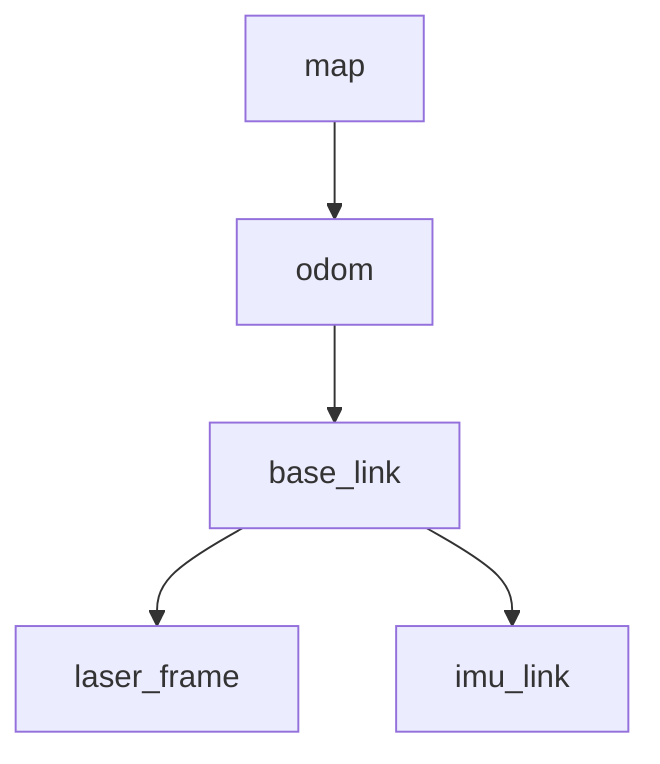
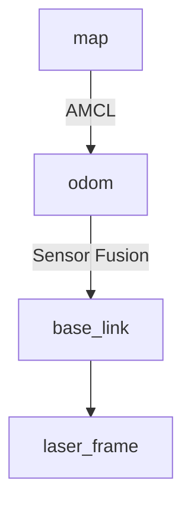

# Mecanum Navigation Setup

**Package:** `mecanum_navigation_setup`

This package configures the ROS 2 Navigation Stack (Nav2) for a mecanum-wheeled mobile robot. It provides a robust framework for SLAM (Simultaneous Localization and Mapping), autonomous path planning, and obstacle avoidance in warehouse environments.

## Overview

The navigation stack integrates three primary components:

  * **Cartographer:** Performs real-time SLAM to generate occupancy grid maps.
  * **Nav2 (Navigation 2):** Handles global path planning (A\*/Dijkstra), local trajectory execution (DWB Controller), and recovery behaviors.
  * **AMCL (Adaptive Monte Carlo Localization):** Probabilistic localization system for positioning the robot within a static map.

## Package Contents

```text
mecanum_navigation_setup/
├── config/
│   ├── cartographer*.lua         # Cartographer SLAM internal configurations
│   ├── mapper_params*.yaml       # SLAM Toolbox/Mapper node parameters
│   ├── nav2_params.yaml          # Standard Nav2 stack parameters
│   └── nav2_params_stvl.yaml     # Alternative Nav2 config (e.g., Spatiotemporal Voxel Layer)
├── launch/
│   ├── slam.launch.py            # SLAM Toolbox entry point
│   ├── cartographer.launch.py    # Cartographer SLAM entry point
│   ├── navigation.launch.py      # Standard Nav2 launch (with AMCL)
│   ├── navigation_stvl.launch.py # Alternative navigation launch
│   └── amcl_navigation.launch.py # AMCL localization specific launch
├── maps/                         # Storage for generated maps (.pgm + .yaml)
├── rviz/                         # RViz visualization profiles
└── scripts/                      # Helper utilities and post-processing scripts
```

## Quick Start Guide

### 1\. Mapping (SLAM)

Generate a new map of the environment using Cartographer.

**Step 1: Launch Simulation**

```bash
ros2 launch mecanum_gazebo simulation_world.launch.py
```

**Step 2: Start SLAM**

```bash
ros2 launch mecanum_navigation_setup slam.launch.py use_sim_time:=true
```

**Step 3: Explore and Save**
Use the keyboard teleop node to drive the robot around the environment until the map is complete.

```bash
# In a new terminal
ros2 run teleop_twist_keyboard teleop_twist_keyboard
```

**Step 4: Save the Map**

```bash
ros2 run nav2_map_server map_saver_cli -f ~/maps
# Move the resulting .pgm and .yaml files to mecanum_navigation_setup/maps/
```

### 2\. Autonomous Navigation

Navigate using a pre-existing map.

#### Simulation Mode

```bash
# Terminal 1: Simulation
ros2 launch mecanum_gazebo simulation_world.launch.py

# Terminal 2: Navigation
ros2 launch mecanum_navigation_setup cartographer_navigation.launch.py \
  use_sim_time:=true \
  map:=<path_to_map.yaml>
```

#### Hardware Mode

```bash
# On Robot Computer
ros2 launch mecanum_bringup hardware.launch.py

# On Remote PC / Laptop
ros2 launch mecanum_navigation_setup navigation.launch.py \
  use_sim_time:=false \
  map:=<path_to_map.yaml> \
  use_rviz:=true
```

#### Sending Goals

1.  Open **RViz**.
2.  Use the **2D Pose Estimate** tool to align the robot's position with the map.
3.  Use the **Nav2 Goal** tool to set a destination.

## Configuration Files

### SLAM Configuration

| File | Description |
| :--- | :--- |
| **`cartographer.lua`** | Main configuration for real-time mapping. |
| **`cartographer_mapping.lua`** | Configures the full TF chain (`map` → `odom` → `base_link`). |
| **`cartographer_odom.lua`** | Performs sensor fusion only (`odom` → `base_link`); used when AMCL handles the map frame. |

### Nav2 Configuration

Defined primarily in **`nav2_params.yaml`**.

  * **Controller:** Holonomic velocity controller optimized for mecanum drive.
  * **Planner:** Global path planning using Dijkstra or A\*.
  * **Costmaps:**
      * *Global:* Static map layer + inflation.
      * *Local:* Rolling window with obstacle detection.
  * **Behaviors:** Recovery actions (spin, backup) and Behavior Trees.

## Launch File Reference

| Launch File | Purpose | Key Arguments |
| :--- | :--- | :--- |
| `slam.launch.py` | Runs SLAM Toolbox. | `use_sim_time`, `resolution` |
| `cartographer_navigation.launch.py` | **Main Entry:** Runs Cartographer, AMCL, and Nav2. | `use_sim`, `map`, `params_file` |

**Common Arguments:**

  * `use_sim_time` (bool): Set to `true` for Gazebo, `false` for real hardware.
  * `map` (string): Absolute path to the `.yaml` map file.
  * `params_file` (string): Path to custom Nav2 configuration file.
  * `use_rviz` (bool): Toggle RViz visualization (default: `true`).

## Key Topics and Services

### Sensor Inputs

  * `/scan`: 2D Laser scan data.
  * `/odom`: Wheel odometry (feedback from hardware).
  * `/imu/data`: IMU orientation and angular velocity.

### Navigation Interfaces

  * `/cmd_vel`: Velocity commands generated by Nav2 (output).
  * `/map`: The global occupancy grid.
  * `/plan`: Visual path for the global plan.
  * `/local_plan`: Visual trajectory for the local controller.

### Localization

  * `/amcl_pose`: Robot's estimated pose on the map.
  * `/particlecloud`: Visual representation of AMCL particle filter confidence.

### Action Servers

  * `/navigate_to_pose`: Send robot to a specific coordinate.
  * `/follow_waypoints`: Execute a sequence of navigation goals.

## Map Post-Processing (Tape Bounds)

If using the tape-line boundary script, run the following after saving your map:

```bash
python ~/inter_iit_ws/src/mecanum_navigation_setup/maps/updated_map_for_tape.py
```

**Note:** This script generates `new_map.pgm` with added boundaries for tape detection.

  * **Crucial:** You must update the `map.yaml` file referenced in `cartographer_navigation.launch.py` to point to this new image if you wish to enforce these bounds during navigation.

## TF Frame Structure

**1. Mapping Mode (SLAM)**
Cartographer publishes the map-to-odom transform.



**2. Navigation Mode (AMCL)**
AMCL publishes map-to-odom based on localization; Odometry source (encoders/IMU) publishes odom-to-base.



-----
